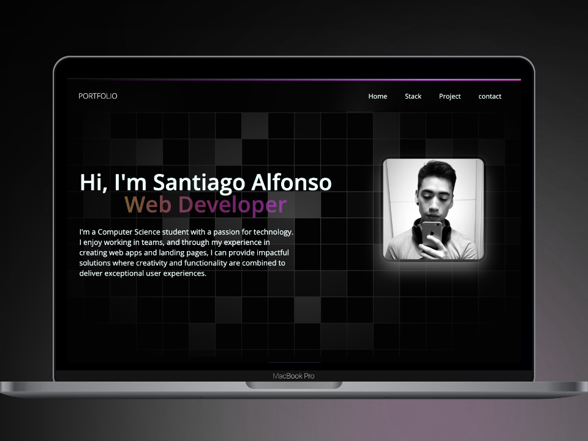

# Link https://www.santiago-alfonso.com/ 

# My portfolio created with the following technologies:

1. Framework Astro v4.4.6
2. React v18.2.0
3. TailwindCss v3.4.1
4. TypeScript v5.3.3
5. HTML5
6. CSS3




## 🚀 Project Structure

```text
/
├── public/
│   └── favicon.svg
├── src/
│   ├── components/
│   │   └── Card.astro
│   ├── layouts/
│   │   └── Layout.astro
│   └── pages/
│       └── index.astro
└── package.json
```
